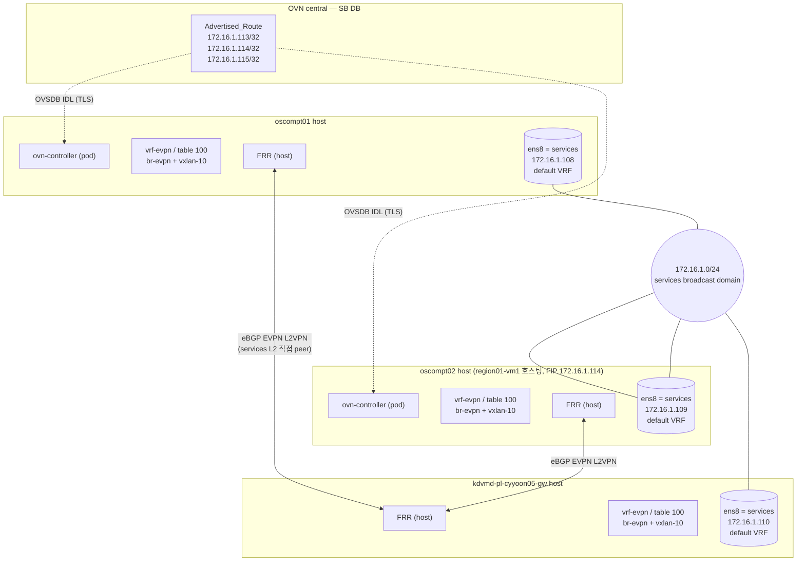
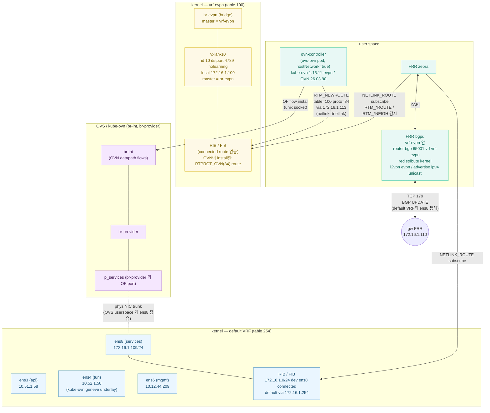
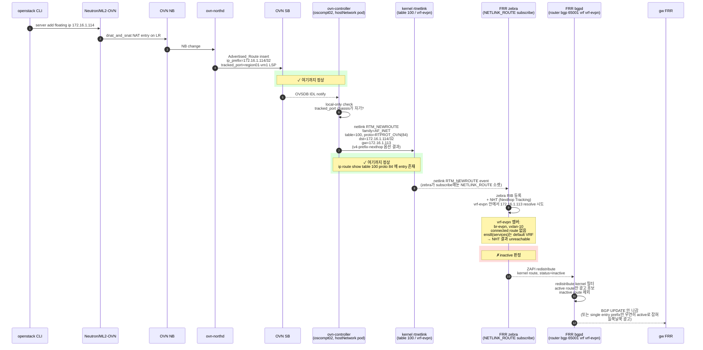
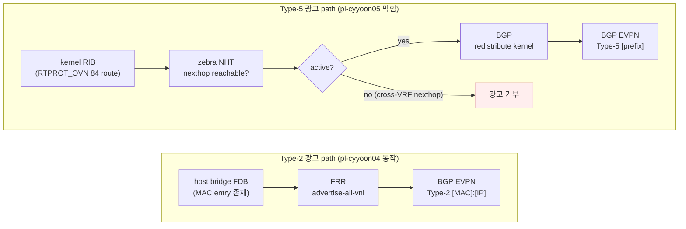
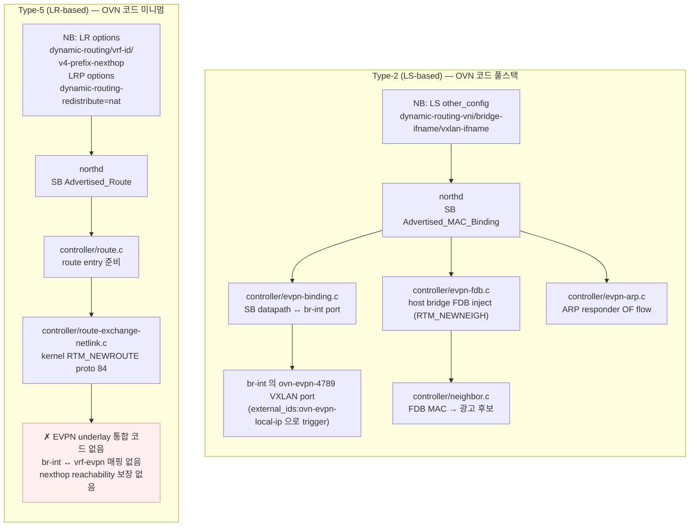
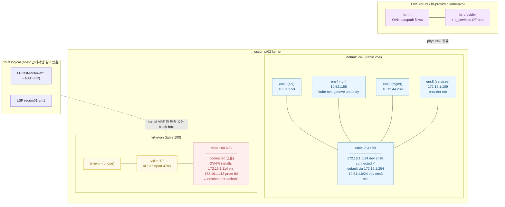
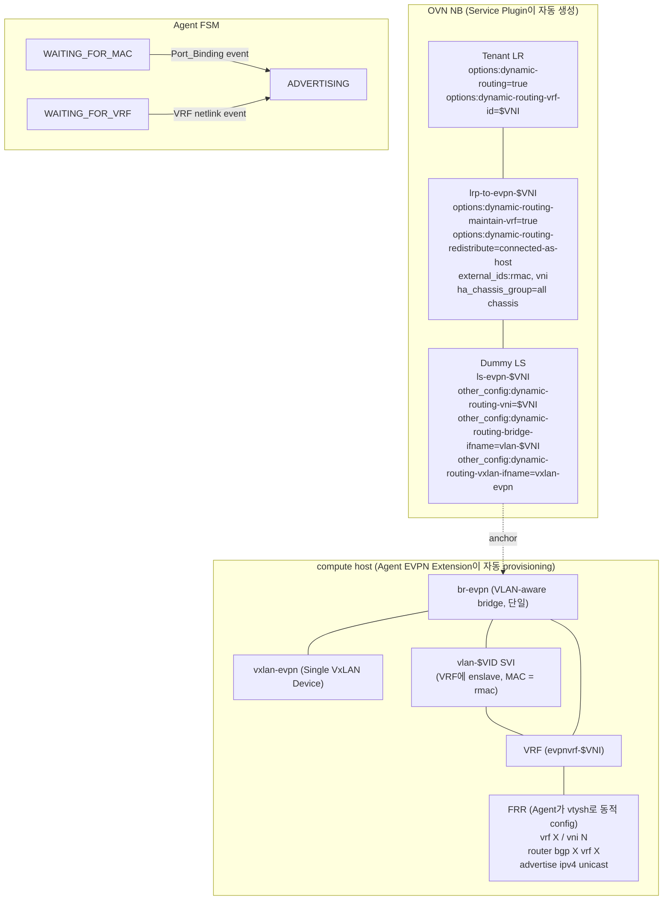

# 왜 막혔나, upstream은 어디까지 왔나

01에서 막힌 이유를 layer 별로 파헤치고 upstream(Neutron, OVN-Kubernetes, kube-ovn) 진행 상황을 정리.

## 테스트한 아키텍처 — 전체 토폴로지

01에서 시도한 구성. compute 두 대 + gw 한 대. 노드 간은 services L2 (172.16.1.0/24) broadcast domain 으로 묶여 있다.



이 그림은 노드 간 통신 그림만. 각 노드 안의 NIC ↔ OVS ↔ VRF ↔ FRR ↔ ovn-controller 관계는 한 노드(oscompt02)만 zoom-in 해서 보면 다음과 같다.

## oscompt02 한 노드 내부 — zoom-in

NIC, OVS bridges (kube-ovn 의 OVS), VRF/bridge/vxlan, FRR, ovn-controller pod 의 위치와 netlink 통신을 명시:



읽는 법:
- 파란색 = default VRF (table 254). services iface 와 다른 NIC 들이 여기 소속
- 노란색 = vrf-evpn (table 100). br-evpn 과 vxlan-10 만 있고 nexthop 으로 갈 connected route 없음
- 보라색 = OVS / kube-ovn 의 OVS bridge. br-int 가 OVN datapath, br-provider 가 외부 망
- 녹색 = user space process (ovn-controller, FRR daemon)

netlink 통신 표기:
- **ovn-controller → kernel**: rtnetlink RTM_NEWROUTE 로 vrf-evpn(table 100)에 `proto 84 via 172.16.1.113` route install
- **FRR zebra → kernel**: NETLINK_ROUTE 소켓 subscribe 로 RTM_*ROUTE / RTM_*NEIGH event 감시. RIB 갱신
- **ovn-controller → OVS (br-int)**: netlink 아님, unix socket (ovsdb/ovs-vswitchd) 로 OF flow install. EVPN 광고와는 별개 경로

문제 지점:
- ovn-controller가 install 한 route 는 `via 172.16.1.113 dev ens8` 형태로 들어가는데, **ens8 은 default VRF 소속**
- zebra 의 NHT 가 vrf-evpn 안에서 172.16.1.113 resolve 시도 → vrf-evpn 안에는 ens8 도 없고 connected 172.16.1.0/24 route 도 없음 → unreachable
- → inactive → bgpd 의 redistribute kernel 후보에서 빠짐 → BGP UPDATE 안 나감

핵심 fact: **services iface(ens8)는 default VRF, vrf-evpn 에는 br-evpn/vxlan-10 뿐**. NIC 가 다른 VRF 에 있어서 nexthop 검증이 실패하는 게 이번 PoC 의 근본 막힘점.

## 광고가 어디까지 살아있다가 어디서 죽는지



표시한 netlink 흐름:
- `rtnetlink` (`AF_NETLINK` + `NETLINK_ROUTE`) 가 ovn-controller → kernel, kernel → zebra 양방향 모두에 쓰임
- ovn-controller 가 RTM_NEWROUTE 로 vrf-evpn(table 100) 에 route 적기
- zebra 가 NETLINK_ROUTE 소켓을 미리 subscribe 해놓고, kernel 의 route 변경 event 를 받음
- zebra ↔ bgpd 는 netlink 아닌 ZAPI (FRR 내부 IPC)

녹색이 통과, 빨강이 stuck.

`show ip route vrf vrf-evpn` 의 실제 출력:

```
K   172.16.1.113/32 [0/100] via 172.16.1.113, services (vrf default) inactive
K   172.16.1.113/32 [0/100] unreachable (blackhole) inactive
K   172.16.1.114/32 [0/100] via 172.16.1.113, services (vrf default) inactive
K   172.16.1.114/32 [0/100] unreachable (blackhole) inactive
K>* 172.16.1.115/32 [0/1000] unreachable (blackhole)
```

읽는 법:
- `K` = kernel proto route (zebra 가 RTPROT_OVN(84) 를 kernel route 로 인식)
- `>` = best path, `*` = FIB 에 install
- `(vrf default)` = nexthop 의 device 가 vrf-evpn 이 아닌 다른 VRF — **cross-VRF nexthop**
- `inactive` = nexthop unresolved → 광고 제외

113, 114 가 두 줄씩 보이는 건 ovn-controller 가 `v4-prefix-nexthop` 옵션 set 전/후의 route 둘 다 install 했고 cleanup이 늦은 흔적. 둘 다 inactive 이긴 마찬가지.

115 만 active(`K>*`) 인 건 entry 가 하나뿐이라 FRR best-path 선택이 단순 통과한 결과. 광고 받는 prefix 가 시간에 따라 들쭉날쭉했던 이유가 이거.

## Layer 별 원인

### Layer 1 — L2 광고 vs L3 광고의 의미론

이전 lab(pl-cyyoon04)의 Type-2 는 동작했는데 Type-5 는 안 됐다. 외형은 둘 다 BGP EVPN `l2vpn evpn` address-family 안의 NLRI 인데, **광고 가능 여부를 결정하는 routing 의미론이 완전히 다르다**.



Type-2 는 nexthop 개념 자체가 없다. "이 MAC 이 이 VTEP 뒤에 있다" 는 L2 reachability 정보고, FDB entry 만 있으면 광고. 검증 절차 없음.

Type-5 는 L3 routing. nexthop 검증 필수. zebra 의 NHT(Nexthop Tracking) 가 같은 VRF 안에서 nexthop 도달성 확인 → reachable 해야 active → BGP redistribute 후보. 이건 RFC 4271 표준 동작이라 FRR 가 아닌 어떤 routing daemon 으로 바꿔도 결과 같다.

### Layer 2 — OVN 측 통합 코드의 비대칭



Type-2 는 OVN 이 host bridge FDB 까지 직접 inject 한다. br-int 와 host bridge 의 통합점도 OVN 이 만든다 (`ovn-evpn-4789` VXLAN port 자동 생성). FRR 는 그저 host bridge 의 local FDB 를 보고 광고하면 끝.

Type-5 는 OVN 이 kernel routing table 에 entry 하나 적는 게 끝. 나머지는 사용자(FRR)에게 맡긴다. EVPN underlay 와 LR routing context 의 통합점이 없다.

### Layer 3 — Linux VRF 와 OVN datapath 의 mismatch

NIC 가 어느 VRF 에 소속됐는지가 routing 결정을 좌우. 이번 PoC 의 NIC 분포:



NIC 가 들어가는 VRF 가 routing 결정의 anchor. **`172.16.1.0/24` connected route 가 있는 곳은 default VRF (ens8 통해)** 뿐. vrf-evpn 에는 br-evpn 과 vxlan-10 만 있어서 같은 subnet 의 nexthop 을 풀 길이 없다.

Linux VRF 는 strict L3 격리. 한 VRF 안의 route lookup 은 그 VRF 의 device 들 사이에서만. nexthop 이 다른 VRF 의 device 를 가리키면 cross-VRF 로 분류돼 zebra NHT 가 inactive 처리.

OVN datapath 는 자체 logical network. br-int OF flow 가 LR/LS 의 모든 처리를 함. 외부에서 보면 black-box. kernel VRF 와 매핑할 표준 인터페이스가 없다. `dynamic-routing-vrf-id` 는 단지 "어느 table 에 route 적을지" 알려주는 hint 일 뿐, OVN datapath 와 kernel VRF 의 routing context 를 연결하지 않는다.

결과: OVN 이 vrf-evpn(table 100) 안에 route 를 넣어도, 그 route 의 nexthop(172.16.1.113)을 vrf-evpn 안에서 풀 길이 없다. services iface 는 default VRF 에 있고 br-evpn 은 EVPN underlay 전용이라 외부 reachability 제공 안 함.

### 우회 가능성

광고만 통과시키는 게 목적이라면 vrf 안에 fake nexthop reachability 를 미리 만들어두는 trick 으로 우회될 수도 있다. 01 의 "추가 검토" 섹션에 옵션 정리해두고 시도 예정. 동작하면 ToR 인프라 도입 전 임시로 compute 직접 종단도 가능해진다. 단 본질적인 해결은 아니고 spec 의 dummy LS + Agent FSM 통합과는 다른 hack 성격이라 production 권장은 여전히 G1.

## 부수적으로 발견한 문제들

광고 실패와 직접 관련은 아니지만 PoC 중 시간 잡아먹은 것들:

| 증상 | 원인 |
| --- | --- |
| `ovs-ovn` securityContext patch 후 ARP responder 가 안 깔림 | daemonset rolling update 만으로는 ovn-controller 가 좀비 상태로 남음. pod 명시적 delete 필수 |
| `dynamic-routing-maintain-vrf=true` 가 동작 안 함 | ycy1766/v1.15.11-evpn 빌드에서 ovn-controller 가 VRF 자동 생성 안 함. 사용자가 직접 만들어야 |
| `local-only=true` 토글 시 광고 사라짐 | install/remove transition 사이 FRR active 상태 잃음. 별개 race 이슈 |
| oscompt01 만 RTPROT_OVN install 안 됨 | VRF 인터페이스 인식 race. 다시 만들고 pod 재기동하면 해결 |
| FDB unique constraint violation 로그 | 수동 br-evpn FDB 와 OVN FDB 충돌. 광고에 결정적 영향은 없는 듯 |
| oscompt01 chassis row UUID 가 stale | pod 재기동 후 새 row 등록됐는데 NB gateway_chassis 가 옛 row 가리키는 시점. 셋업 안정화하면 자체 해결 |

## OpenStack Neutron spec

[bgp_evpn_type_5_route_support](https://specs.openstack.org/openstack/neutron-specs/specs/2026.2/bgp_evpn_type_5_route_support.html) — Neutron 2026.2 target.

spec 도입부에 그대로 명시되어 있다:

> Using OVN and FRR alone is not enough to deploy EVPN Type-5 route advertisement on OpenStack. It is necessary to add a new EVPN Service Plugin to configure OVN with new options. It is also necessary to add a new OVN Agent EVPN Extension to prepare the Linux environment for FRR EVPN as well as to enable EVPN in FRR on each compute/network node.

01에서 막힌 거랑 같은 결론을 spec 작성자들이 먼저 내렸고, 그 gap 을 채우기 위해 두 새 컴포넌트(Service Plugin + Agent Extension)를 만드는 게 spec 의 본체.

### spec 의 architecture



내가 01 에서 빠뜨린 핵심이 **dummy LS** (`ls-evpn-$VNI`). LR 에만 옵션 줬다. spec 보고 나서 회고하면 Type-2 가 LS 에 옵션 줘서 동작한 것이고, Type-5 에도 같은 anchor 가 필요한데 spec 은 그걸 dummy LS 로 푼다.

### 구현 진행도 (2026-05-27 시점)

GitHub openstack/neutron 검색 결과:

| 컴포넌트 | 상태 |
| --- | --- |
| spec 문서 | 머지 완료 (2026-05-20) |
| neutron-lib `evpn` API definition | 머지 완료 (2026-04-30 ~ 05-06) |
| `neutron/agent/ovn/extensions/evpn/` | skeleton + FSM + netlink monitor 머지 (2026-04-13 ~ 04-30) |
| `neutron/services/evpn/plugin.py` | skeleton 머지 (2026-05-21). 코드 안에 `_fake_db_call()` TODO 다수 |

open review 7개가 2026-05-22~26 사이 update:
- DB model 구현 (#987250)
- OVN portion 구현 (#989626)
- FRR driver (#988158)
- Single VxLAN Device management (#990169)
- port_binding events (#989471)
- common constants (#990136)
- BGP plugin 정비 (#988539)

한 달 안에 spec 의 핵심 구현이 review 까지 다 올라온 셈. Red Hat 주도 (코드 카피라이트 + 핵심 author `jlibosva`).

타임라인 추정: 2026.2 GA (2026-10) 에 dev preview, RHOSP backport 후 2027.1~2027.2 에 stable. KCP 운영 적용 가능한 안정성까지는 2027 하반기 이후.

방향성 변화도 명확. 2025-10 에 spec `OVN BGP Agent EVPN Advertisement API Extension` 이 abandoned, 2026-04 에 Neutron native EVPN extension 작업 시작. 즉 사이드카(ovn-bgp-agent) 모델은 폐기되고 Neutron native 로 통합되는 흐름.

ovn-bgp-agent 측에선 EVPN 관련 마지막 commit 이 2025-05 (1년 전). Type-5 native 지원은 0.

## OVN-Kubernetes (별도 프로젝트, 참조용)

KCP 가 쓰는 kube-ovn(Aliyun) 과는 다른 프로젝트지만 architecture 참조용. [OKEP-5088 EVPN Support](https://ovn-kubernetes.io) 가 OVN-Kubernetes 의 EVPN spec.

Neutron spec 과 거의 같은 방향:
- Single VxLAN Device 모델 (MVD 명시적 비채택)
- FRR-K8S 로 FRR config 자동 관리
- node 가 EVPN VTEP (= leaf 역할)
- VTEP CRD (managed/unmanaged) 로 VTEP IP 관리
- CUDN 의 `evpnConfiguration` 으로 macVRF/ipVRF 정의
- Type-2 + Type-5 모두 지원 (Neutron spec 보다 광범위)
- local gateway mode 만 지원

두 upstream 의 architecture 가 거의 일치. node=VTEP, SVD, FRR 자동 관리, leaf-spine 패턴. 차이는 K8s/OpenStack 추상화 정도.

## kube-ovn (KCP 사용 중)

kube-ovn 자체에도 BGP/EVPN 작업이 있다.

| 버전 | 기능 |
| --- | --- |
| v1.15.x | BGP via vpc-nat-gateway, BGP speaker, BgpConf CRD |
| v1.16.0 (2026-04-09) | vpc-egress-gateway 가 BGP+EVPN L3VPN 지원 (PR #6224). FRR 가 egress-gateway Pod 안에서 동작 |

핵심: **OpenStack VM 의 FIP 를 BGP/EVPN 으로 직접 광고하는 path 는 미지원**.

Issue #5010 (2025-08-10 closed) 에서 정확히 이 use case 를 요청했는데 kube-ovn 메인테이너 `oilbeater` 답변:

> OVN doesn't natively support BGP for EIP, FIP, and SNAT. This means we might need to introduce a new set of agents or controllers and possibly modify the network flow. This isn't an easy feature.

즉 kube-ovn 측도 OpenStack VM/FIP 의 직접 BGP 광고는 별도 컴포넌트 필요하다고 인식. 메인테이너 `zbb88888` 이 ovn-bgp-agent dive into 한다고 했지만 그 후 진행은 미정.

## 종합 정리

01에서 막힌 게 알고 보니 OpenStack 과 K8s 양쪽 upstream 이 모두 인지하고 작업 중인 known gap 이었다. 운영 적용 가능한 솔루션이 나오기까지 1~2년. KCP 는 그동안 다른 path 가 필요하다. 그게 다음 노트의 G1.

| 후보 | 평가 |
| --- | --- |
| Neutron 2026.2 spec 대기 | 1~2년. spec 모델(compute=VTEP)이 KCP fabric 전략(ToR=VTEP) 과 다름 |
| ovn-bgp-agent 채용 | EVPN Type-5 native 미지원 (Type-2 anycast 만). 우리 use case 안 맞음 |
| kube-ovn 자체 EVPN 확장 대기 | OpenStack VM 직접 광고는 메인테이너도 별도 컴포넌트 필요하다고 인정 |
| OVN-Kubernetes 마이그레이션 | 너무 큰 변경 |
| **vrf 안 fake reachability trick (01 추가 검토)** | 동작하면 ToR 전 임시 path. 본질적 해결은 아님 |
| **G1: ToR가 EVPN 종단, compute는 BGP IPv4만** | 즉시 가능. upstream 의존 0. KCP 네트워크팀의 ToR-EVPN 결정과 정렬 |
