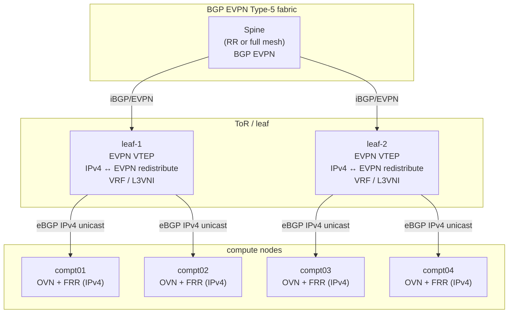
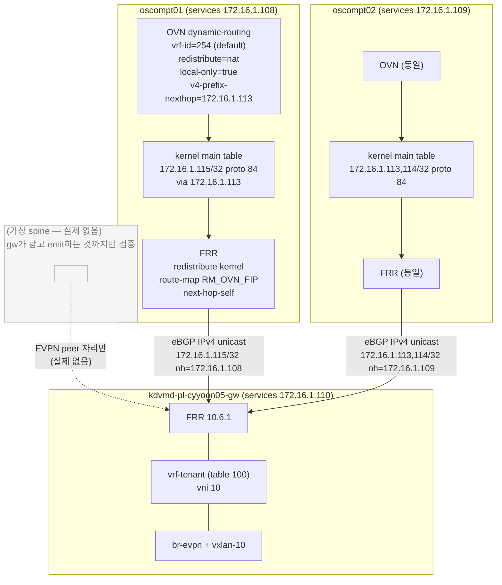
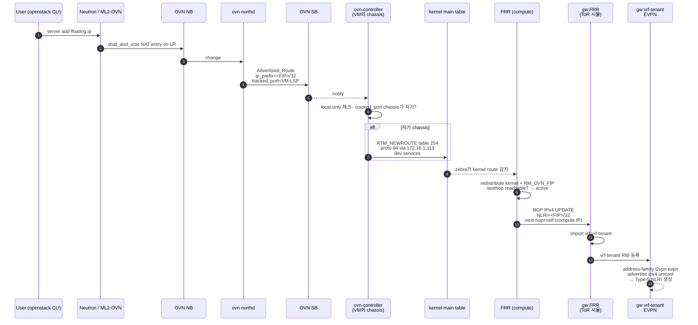
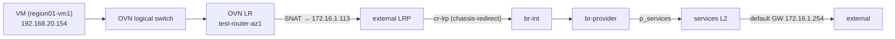
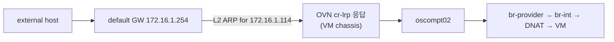
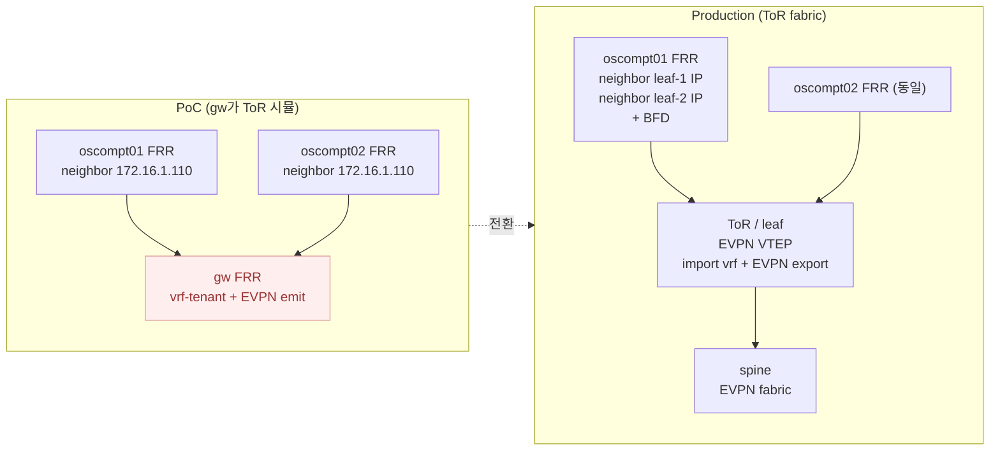

# G1 - ToR에 EVPN 위임, compute는 BGP IPv4 only

02에서 정리한 한계 때문에 compute에서 직접 EVPN 종단하는 건 포기. 대신:

- compute는 OVN dynamic-routing + FRR로 BGP IPv4 unicast만 광고
- ToR(leaf)가 받아서 자기 VRF로 import하고 EVPN Type-5로 fabric 전파

ToR 인프라가 아직 준비 안 됐으니 gw 노드(`kdvmd-pl-cyyoon05-gw`)를 ToR 역할로 두고 검증한다.

## Architecture

운영 목표:



PoC (gw가 ToR 역할):



PoC와 production 차이:
- gw 1대가 두 leaf 역할 동시 수행
- spine 없음. gw에서 EVPN Type-5가 emit되는 것까지만 검증
- compute쪽 OVN/FRR 설정은 production과 동일. ToR 도입 시 neighbor IP만 바뀐다

## Control plane 흐름



## Data plane

광고와 별개로 데이터 평면은 OVN의 기존 경로 그대로다.

Egress (VM → 외부):



Ingress with EVPN advertise (외부 → FIP, fabric routing 활용):


Ingress without advertise (광고 OFF, 기존 동작):



광고 ON/OFF 둘 다 외부 도달성 유지된다. 광고는 부가, 데이터 평면 미파괴.

## compute 설정

### Cleanup

01에서 만들었던 vrf-evpn/br-evpn/vxlan-10 트리오 제거. G1은 default VRF만 쓴다.

```bash
for ip in 10.51.1.57 10.51.1.58; do
  ssh root@$ip 'ip link del vxlan-10 2>/dev/null; ip link del br-evpn 2>/dev/null; ip link del vrf-evpn 2>/dev/null; true'
done
```

kube-ovn 사전작업 (securityContext, chown, pod 강제 재기동)은 01에서 이미 끝난 상태 가정.

### OVN NB 옵션

기존 PoC 옵션 cleanup하고 G1 옵션 set:

```bash
ROUTER_LR=neutron-c26ce272-3006-4ee3-9f26-caf465fae13b
EXT_LRP=lrp-48e53ee8-56b5-48b7-ba25-c2564ed9febf

kubectl-ko nbctl remove logical_router "$ROUTER_LR" options dynamic-routing-vrf-name 2>/dev/null
kubectl-ko nbctl remove logical_router_port "$EXT_LRP" options dynamic-routing-maintain-vrf 2>/dev/null

kubectl-ko nbctl set logical_router "$ROUTER_LR" \
  options:dynamic-routing=true \
  options:dynamic-routing-vrf-id=254 \
  options:dynamic-routing-redistribute-local-only=true \
  options:dynamic-routing-v4-prefix-nexthop=172.16.1.113

kubectl-ko nbctl set logical_router_port "$EXT_LRP" \
  options:dynamic-routing-redistribute=nat
```

01과 비교해서 바뀐 것:
- `vrf-id=100` → `254` (kernel main table)
- `vrf-name` 제거
- `maintain-vrf` 제거 (default VRF라 불필요)
- `v4-prefix-nexthop=172.16.1.113` 추가 (LR external gw IP)

옵션 적용 후:

```bash
ssh root@10.51.1.57 'ip route show proto 84'
# 172.16.1.115 via 172.16.1.113 dev services proto 84 metric 100  (예상)

ssh root@10.51.1.58 'ip route show proto 84'
# 172.16.1.113, 172.16.1.114 via 172.16.1.113 dev services proto 84 metric 100
```

`dev services`로 잡히면 default VRF의 인터페이스라 FRR가 active 처리 가능.

### FRR (oscompt01)

```
frr defaults datacenter
hostname kdvmd-pl-cyyoon05-oscompt01
service integrated-vtysh-config
!
ip prefix-list FIP-RANGE seq 5 permit 172.16.1.0/24 le 32 ge 32
!
route-map RM_OVN_FIP permit 10
 match ip address prefix-list FIP-RANGE
 match source-protocol kernel
!
router bgp 65001
 bgp router-id 172.16.1.108
 no bgp default ipv4-unicast
 neighbor 172.16.1.110 remote-as 65000
 !
 address-family ipv4 unicast
  neighbor 172.16.1.110 activate
  neighbor 172.16.1.110 next-hop-self
  redistribute kernel route-map RM_OVN_FIP
 exit-address-family
exit
```

oscompt02는 router-id만 `172.16.1.109` 로 바꿔서 동일하게.

01과 비교해서 빠진 것:
- VRF 정의
- EVPN address-family
- vrf-* router bgp 블록

EVPN 종단을 ToR(여기선 gw)이 하기 때문에 compute쪽은 평범한 IPv4 unicast 라우터로 동작.

restart 후 확인:

```bash
ssh root@10.51.1.57 'vtysh -c "show ip route 172.16.1.115" -c "show bgp ipv4 unicast"'
# K>* 172.16.1.115/32 via 172.16.1.113, services 가 active 로 보이고
# show bgp 에 self-originated 로 등장해야
```

## gw 설정 (ToR 시뮬레이션)

### 호스트 인터페이스

이번엔 gw쪽이 EVPN VTEP 역할이라 VRF/bridge/vxlan을 gw에 만든다.

```bash
ssh root@10.12.44.120 bash <<'EOF'
VNI=10; LOCAL_IP=172.16.1.110; TABLE_ID=100

ip link del vxlan-$VNI 2>/dev/null
ip link del br-evpn    2>/dev/null
ip link del vrf-tenant 2>/dev/null

ip link add vrf-tenant type vrf table $TABLE_ID
ip link set vrf-tenant up
ip link add br-evpn type bridge
ip link set br-evpn master vrf-tenant
ip link set br-evpn up
ip link add vxlan-$VNI type vxlan id $VNI local $LOCAL_IP dstport 4789 nolearning
ip link set vxlan-$VNI master br-evpn
ip link set vxlan-$VNI up
EOF
```

### FRR

```
frr defaults datacenter
hostname kdvmd-pl-cyyoon05-gw
service integrated-vtysh-config
!
vrf vrf-tenant
 vni 10
exit-vrf
!
router bgp 65000
 bgp router-id 172.16.1.110
 no bgp default ipv4-unicast
 neighbor COMPUTE peer-group
 neighbor COMPUTE remote-as 65001
 neighbor 172.16.1.108 peer-group COMPUTE
 neighbor 172.16.1.109 peer-group COMPUTE
 !
 address-family ipv4 unicast
  neighbor COMPUTE activate
  import vrf vrf-tenant
 exit-address-family
 !
 ! 실제 spine peer 자리 (현재 없음)
 ! address-family l2vpn evpn
 !  neighbor <spine> activate
 !  advertise-all-vni
 ! exit-address-family
exit
!
router bgp 65000 vrf vrf-tenant
 bgp router-id 172.16.1.110
 address-family ipv4 unicast
  redistribute kernel
 exit-address-family
 address-family l2vpn evpn
  advertise ipv4 unicast
 exit-address-family
exit
```

`import vrf` 는 FRR 10+ BGP VRF leak 기능. 구버전이면 route-target import/export로 대체.

확인:

```bash
ssh root@10.12.44.120 bash <<'EOF'
vtysh -c 'show bgp ipv4 unicast summary'
vtysh -c 'show bgp ipv4 unicast'
vtysh -c 'show ip route vrf vrf-tenant'
vtysh -c 'show evpn vni'
vtysh -c 'show bgp l2vpn evpn'
EOF
```

기대: `show bgp l2vpn evpn` 에 `[5]:[0]:[32]:[172.16.1.114] VNI 10` 등이 self-originated로 등장. 실제 peer가 없으니 `Advertised to peers:` 가 비어 있는 게 정상.

여기까지 보이면 control plane은 OK. ToR 도입 시점에서 실제 spine으로 전파만 추가하면 된다.

## 검증

```bash
# SB Advertised_Route 확인
kubectl-ko sbctl list Advertised_Route

# compute kernel
ssh root@10.51.1.57 'ip route show proto 84'
ssh root@10.51.1.58 'ip route show proto 84'

# compute FRR가 active 처리
ssh root@10.51.1.57 'vtysh -c "show ip route 172.16.1.115/32"'
ssh root@10.51.1.58 'vtysh -c "show ip route 172.16.1.114/32"'

# compute → gw BGP 광고
ssh root@10.51.1.57 'vtysh -c "show bgp ipv4 unicast"'
ssh root@10.51.1.58 'vtysh -c "show bgp ipv4 unicast"'

# gw 수신
ssh root@10.12.44.120 'vtysh -c "show bgp ipv4 unicast"'

# gw EVPN emit
ssh root@10.12.44.120 'vtysh -c "show bgp l2vpn evpn"'

# 데이터 평면 (기존 OVN 경로 정상 동작 확인)
ping -c 3 172.16.1.114
```

### 광고 ON/OFF 비교

```bash
# OFF
kubectl-ko nbctl remove logical_router_port lrp-48e53ee8-56b5-48b7-ba25-c2564ed9febf options dynamic-routing-redistribute
sleep 15
ssh root@10.12.44.120 'vtysh -c "show bgp l2vpn evpn"'   # 광고 사라짐
ping -c 3 172.16.1.114   # 여전히 성공 (기존 경로 살아있음)

# 복구
kubectl-ko nbctl set logical_router_port lrp-48e53ee8-56b5-48b7-ba25-c2564ed9febf options:dynamic-routing-redistribute=nat
```

### local-only 효과

`local-only=true` 면 각 chassis가 자기 chassis 의 FIP만 광고. gw가 받는 것:
- 113 via 172.16.1.109 (cr-lrp가 oscompt02에 있다면)
- 114 via 172.16.1.109 (region01-vm1)
- 115 via 172.16.1.108 (region01-vm2)

서로 다른 nexthop으로 들어와야 ECMP/closest 분산이 가능해진다.

## ToR 전환



전환 시:
- compute FRR neighbor IP만 ToR로 교체 (OVN 옵션은 그대로)
- gw의 vrf-tenant/br-evpn/vxlan/FRR 셋업 모두 제거
- ToR 측 EVPN 종단 설정 (네트워크팀 영역)

compute 측 diff 예시:

```diff
 router bgp 65001
- neighbor 172.16.1.110 remote-as 65000
+ neighbor <ToR-leaf-1-IP> remote-as <ToR-AS>
+ neighbor <ToR-leaf-2-IP> remote-as <ToR-AS>
+ neighbor <ToR-leaf-1-IP> bfd
  address-family ipv4 unicast
-  neighbor 172.16.1.110 activate
-  neighbor 172.16.1.110 next-hop-self
+  neighbor <ToR-leaf-1-IP> activate
+  neighbor <ToR-leaf-1-IP> next-hop-self
+  neighbor <ToR-leaf-2-IP> activate
+  neighbor <ToR-leaf-2-IP> next-hop-self
   redistribute kernel route-map RM_OVN_FIP
```

## 네트워크팀과 정의할 항목

- BGP peering 방식 (eBGP/iBGP)
- compute / ToR ASN
- peer IP (services iface 직접 vs loopback vs BGP unnumbered)
- BFD 사용 여부
- 광고 prefix 범위 정책 (FIP /32 만? SNAT subnet도?)
- L3VNI 할당 / route-target 정책
- HA convergence 목표 시간
- Service / LoadBalancer IP 광고 (MetalLB 또는 통합)

## 트러블슈팅 메모

- compute에 `ip route show proto 84` 가 비어있음 → OVN 옵션 다시 확인하고 ovs-ovn pod 강제 재기동
- FRR `show ip route` 에 `inactive` → nexthop 도달성 점검. default VRF에서 `ping 172.16.1.113` 부터
- BGP 세션 안 붙음 → ASN, neighbor IP, services L2 도달성, `frr defaults` 가 `datacenter` 인지
- gw vrf-tenant에 import 안 됨 → FRR 버전 확인 (`import vrf` 는 10.x+), 또는 route-target import/export로
- EVPN Type-5 emit 안 됨 → `vrf vrf-tenant / vni 10` 정의, `advertise ipv4 unicast`, `show evpn vni` 확인

## 한계

- 실제 spine/EVPN peer가 없어서 fabric 전파/외부 routing 검증 불가
- gw 단일점이라 멀티홈/BFD/ECMP 검증 불가
- ToR 벤더 기능 (EVPN multihoming, anycast gateway 등) 검증 불가
- MetalLB / Service IP 광고는 별도 작업

여기까지가 control plane 정확성 + OVN/FRR 설정 검증. 데이터 평면 전체 검증은 ToR 도입 후.
