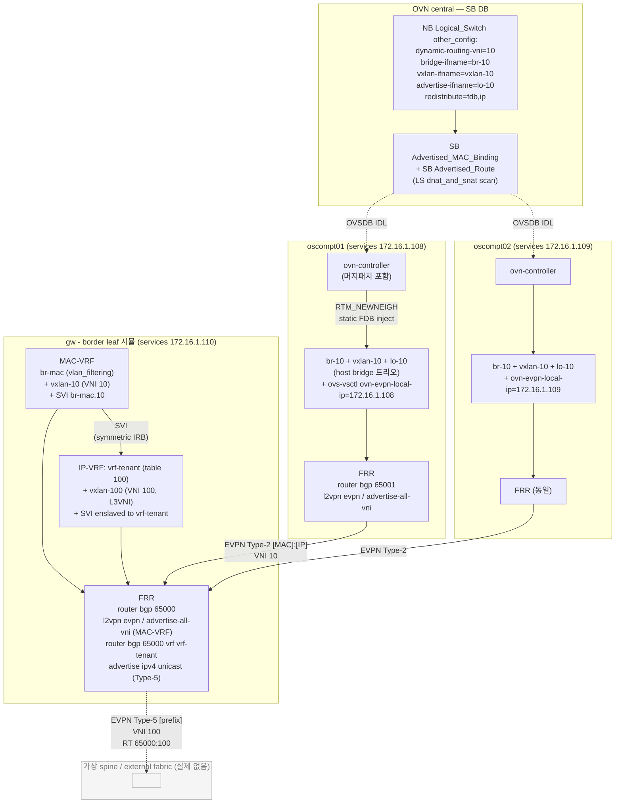
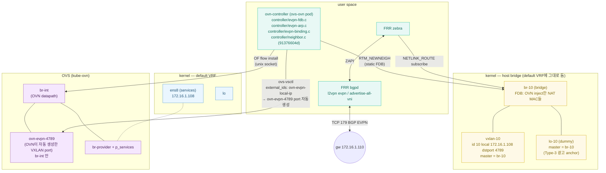
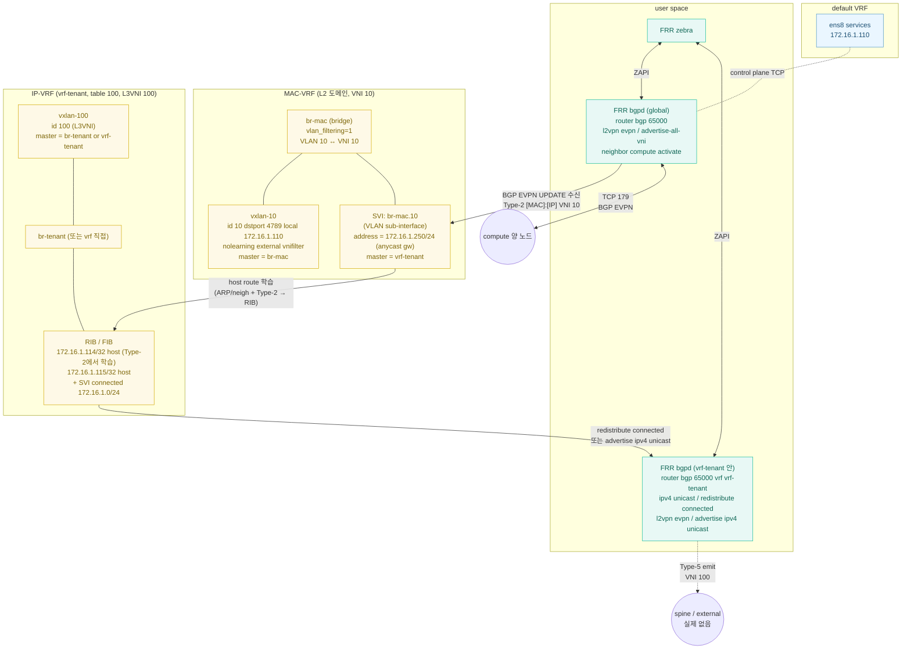
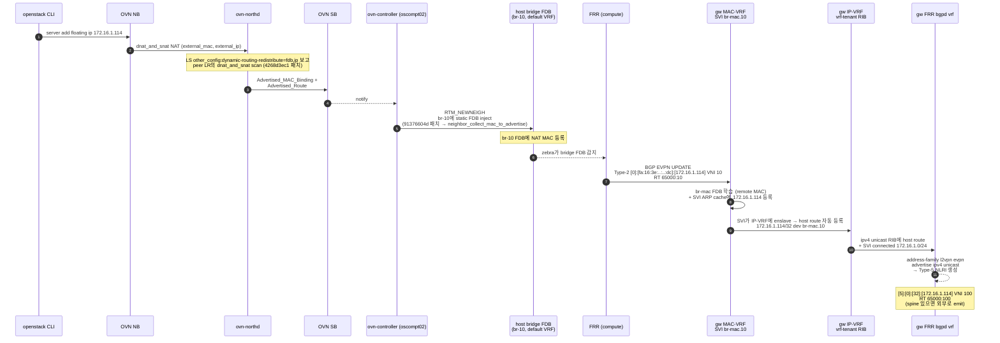
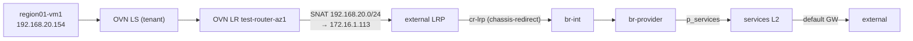
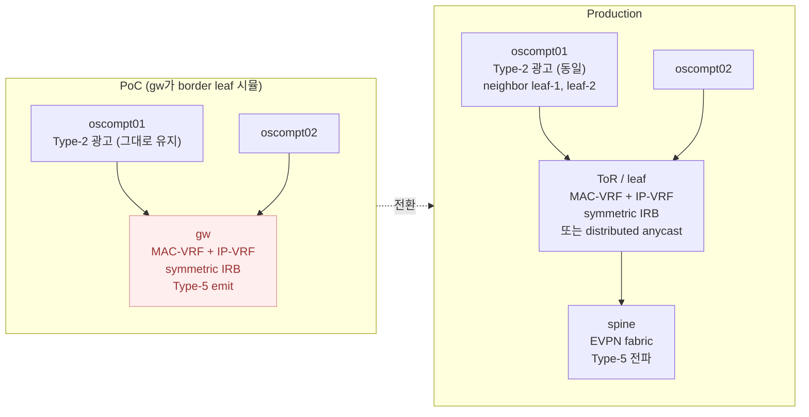

# 하이브리드 - compute는 Type-2, 상단은 Type-5 (Symmetric IRB)

03의 G1 외에 가능한 또 다른 path. compute는 pl-cyyoon04에서 이미 검증된 Type-2 광고를 그대로 쓰고, gw(또는 ToR)이 받은 Type-2의 IP를 자기 IP-VRF에서 Type-5로 재광고. EVPN 표준의 Symmetric IRB 패턴.

## 왜 이 방식인가

| 항목 | G1 (compute IPv4 → ToR Type-5) | Hybrid (compute Type-2 → ToR Type-5) |
| --- | --- | --- |
| compute 측 검증 | nexthop trick 필요 (이번 PoC에서 막혔던 path) | pl-cyyoon04에서 검증 완료 |
| compute 의존성 | OVN main의 dynamic-routing | 머지된 두 패치 (`4268d3ec1`, `91376604d`) — 이미 ycy1766 빌드에 포함 |
| compute 측 host 인터페이스 | 거의 없음 | br-10 + vxlan-10 + lo-10 트리오 (pl-cyyoon04 패턴) |
| ToR 측 책임 | IPv4 → EVPN Type-5 redistribute | Type-2 → IRB SVI → Type-5 (Symmetric IRB) |
| EVPN 표준성 | redistribute는 옵션적 패턴 | Symmetric IRB는 RFC 9135 정의 |

EVPN 산업 표준에 더 가깝고, compute 측 path가 이미 검증됐다는 게 강점. 대신 compute 셋업이 무겁다.

## 전체 architecture



흐름 한 줄: 머지 패치가 OVN이 LS의 NAT external_mac/IP를 host bridge FDB로 inject → FRR가 Type-2로 광고 → gw가 받아서 IRB SVI 통해 IP-VRF의 connected route로 잡고 → Type-5로 외부 fabric에 광고.

## compute 노드 zoom-in (oscompt01 예시)



핵심:
- **br-10 트리오는 default VRF에 그대로** (vrf-evpn 같은 별도 VRF로 묶지 않음). Type-2는 L2 reachability라 VRF 격리 무관.
- **OVN이 FDB inject + br-int에 ovn-evpn-4789 port 자동 생성** — 머지된 두 패치가 핵심. Type-5에 대응되는 통합이 없는 것과 비대칭.
- **FRR는 그저 host bridge의 local FDB를 보고 Type-2 emit**. nexthop 검증 없음.

## gw (border leaf 시뮬) zoom-in - Symmetric IRB



Symmetric IRB의 핵심:
- **MAC-VRF (VNI 10)** 에 SVI를 두고 그 SVI를 **IP-VRF (vrf-tenant)** 에 enslave
- compute가 보낸 Type-2 [MAC]:[IP] 를 받으면 zebra가 host route(`/32`)로 RIB에 등록
- IP-VRF의 RIB에 들어간 host route가 `advertise ipv4 unicast` 로 자동 Type-5 export
- L3VNI 100 (별도 vxlan)이 Type-5 data plane용

## Control plane - 광고 흐름



특징:
- **compute는 RTM_NEWNEIGH (FDB) 만 다룬다**. nexthop 검증 없음. RTM_NEWROUTE도 없음.
- **gw는 두 평면 모두**: Type-2 수신 + symmetric IRB로 host route 학습 + Type-5 emit.
- 가상 spine 없으니 Type-5는 emit까지만 검증 (`show bgp l2vpn evpn`에 self-originated로 나타남).

## Data plane - 패킷 흐름

### Egress (VM → 외부)

광고와 무관. OVN의 기존 distributed SNAT 그대로:



### Ingress - Type-2 path (같은 EVPN VNI 안의 다른 host에서 보낸 패킷)

예: gw 의 br-mac.10 (SVI 172.16.1.250) 에서 172.16.1.114 로 보내는 경우. 또는 fabric 안의 다른 leaf에 붙은 host.

```mermaid
flowchart LR
  Src["같은 VNI 10 안의 host<br/>(예: gw SVI)"] --"ARP 172.16.1.114"--> BrMac["gw br-mac"]
  BrMac --"FDB 학습: MAC = fa:16:3e:..:dc<br/>via VNI 10, remote VTEP 172.16.1.109"--> Vx["vxlan-10"]
  Vx --"VXLAN encap VNI 10<br/>dst 172.16.1.109"--> Net["services L2"]
  Net --> Compt["oscompt02 services iface"]
  Compt --> EvpnPort["br-int의 ovn-evpn-4789 port"]
  EvpnPort --"OVN datapath flow<br/>VNI 10 → LSP region01-vm1"--> BrInt["br-int"]
  BrInt --"DNAT 172.16.1.114 → 192.168.20.154"--> LR["OVN LR"]
  LR --> VM["VM"]
```



Type-2 path의 핵심: VXLAN VNI 10이 곧장 br-int의 ovn-evpn-4789 port로 들어가서 OVN datapath가 처리. pl-cyyoon04에서 검증한 path.

### Ingress - Type-5 path (외부 fabric에서)

외부 fabric (spine 또는 다른 site의 leaf) 이 Type-5 [prefix] 를 학습해서 보내는 경우. nexthop = gw VTEP.

```mermaid
flowchart LR
  Ext["external host"] --"dst 172.16.1.114"--> Spine["spine"]
  Spine --"Type-5 학습<br/>nexthop = gw VTEP 172.16.1.110<br/>L3VNI 100"--> Spine
  Spine --"VXLAN encap VNI 100<br/>dst 172.16.1.110"--> GwVx["gw vxlan-100 (L3VNI)"]
  GwVx --"VXLAN decap<br/>vrf-tenant RIB lookup"--> GIP["gw IP-VRF<br/>172.16.1.114/32 host route<br/>via br-mac.10 (SVI)"]
  GIP --"SVI 통해 MAC-VRF로<br/>(symmetric IRB)"--> BrMac["gw br-mac"]
  BrMac --"FDB lookup → remote VTEP 172.16.1.109<br/>VNI 10으로 re-encap"--> Vx10["gw vxlan-10"]
  Vx10 --"VXLAN encap VNI 10<br/>dst 172.16.1.109"--> Net["services L2"]
  Net --> Compt["oscompt02"]
  Compt --> EvpnPort["br-int ovn-evpn-4789"]
  EvpnPort --> BrInt["br-int → DNAT → VM"]
```



Type-5 path: 외부 fabric에서 들어온 패킷이 gw에서 한 번 더 VXLAN re-encap (L3VNI 100 → L2VNI 10). 정통 Symmetric IRB의 ingress path.

## compute 설정 (pl-cyyoon04 재활용)

### Cleanup

이전 PoC의 vrf-evpn 트리오 제거 (G1에서 이미 제거했으면 skip):

```bash
for ip in 10.51.1.57 10.51.1.58; do
  ssh root@$ip 'ip link del vxlan-10 2>/dev/null; ip link del br-evpn 2>/dev/null; ip link del vrf-evpn 2>/dev/null; true'
done
```

### 호스트 트리오 (default VRF)

oscompt01:

```bash
ssh root@10.51.1.57 bash <<'EOF'
VNI=10
LOCAL_IP=172.16.1.108

ip link add br-10 type bridge
ip link set br-10 up
ip link add vxlan-10 type vxlan id $VNI local $LOCAL_IP dstport 4789 nolearning
ip link set vxlan-10 master br-10
ip link set vxlan-10 up
ip link add lo-10 type dummy
ip link set lo-10 master br-10
ip link set lo-10 up
EOF
```

oscompt02는 LOCAL_IP만 172.16.1.109로.

### OVS external_ids (OVN evpn 통합 trigger)

각 compute에서:

```bash
kubectl-ko vsctl kdvmd-pl-cyyoon05-oscompt01 set Open_vSwitch . \
  external-ids:ovn-evpn-local-ip=172.16.1.108 \
  external-ids:ovn-evpn-vxlan-ports=4789

kubectl-ko vsctl kdvmd-pl-cyyoon05-oscompt02 set Open_vSwitch . \
  external-ids:ovn-evpn-local-ip=172.16.1.109 \
  external-ids:ovn-evpn-vxlan-ports=4789
```

ovn-controller가 br-int에 `ovn-evpn-4789` VXLAN port 자동 생성.

### OVN NB - LS other_config

provider net LS에:

```bash
PROVIDER_LS=neutron-bfe4956c-4672-4470-afdd-37b0247782b4

kubectl-ko nbctl set Logical_Switch "$PROVIDER_LS" \
  other_config:dynamic-routing-vni=10 \
  other_config:dynamic-routing-bridge-ifname=br-10 \
  other_config:dynamic-routing-vxlan-ifname=vxlan-10 \
  other_config:dynamic-routing-advertise-ifname=lo-10 \
  other_config:dynamic-routing-redistribute=fdb,ip
```

이 옵션이 OVN northd가 peer LR의 dnat_and_snat 도 scan해서 Advertised_MAC_Binding 생성하게 함 (머지패치 효과).

### compute FRR

```
frr defaults datacenter
hostname kdvmd-pl-cyyoon05-oscompt01
service integrated-vtysh-config
!
router bgp 65001
 bgp router-id 172.16.1.108
 no bgp default ipv4-unicast
 neighbor 172.16.1.110 remote-as 65000
 !
 address-family l2vpn evpn
  neighbor 172.16.1.110 activate
  advertise-all-vni
 exit-address-family
exit
```

VRF/IP-VRF 정의 없음. 단순 MAC-VRF Type-2 광고만.

### compute 검증

```bash
# br-10 FDB에 OVN inject MAC 보임
ssh root@10.51.1.57 'bridge fdb show dev br-10'
# fa:16:3e:..:dc dev br-10 master static  (NAT MAC)

# FRR로 Type-2 emit
ssh root@10.51.1.57 'vtysh -c "show bgp l2vpn evpn"'
# [2]:[0]:[48]:[fa:16:3e:..:dc]:[32]:[172.16.1.114] self-originated
```

## gw 설정 (border leaf 시뮬)

### 호스트 인터페이스

```bash
ssh root@10.12.44.120 bash <<'EOF'
VNI_L2=10
VNI_L3=100
LOCAL_IP=172.16.1.110

# IP-VRF
ip link add vrf-tenant type vrf table 100
ip link set vrf-tenant up

# L3VNI용 vxlan (Type-5 data plane)
ip link add br-tenant type bridge
ip link set br-tenant master vrf-tenant
ip link set br-tenant up

ip link add vxlan-${VNI_L3} type vxlan id ${VNI_L3} local ${LOCAL_IP} dstport 4789 nolearning
ip link set vxlan-${VNI_L3} master br-tenant
ip link set vxlan-${VNI_L3} up

# MAC-VRF (VNI 10 - Type-2 수신)
ip link add br-mac type bridge vlan_filtering 1
ip link set br-mac up

ip link add vxlan-${VNI_L2} type vxlan id ${VNI_L2} local ${LOCAL_IP} dstport 4789 nolearning
ip link set vxlan-${VNI_L2} master br-mac
ip link set vxlan-${VNI_L2} up
bridge vlan add dev vxlan-${VNI_L2} vid ${VNI_L2}
bridge vlan add dev br-mac vid ${VNI_L2} self

# SVI - MAC-VRF에 발 + IP-VRF에 enslave (symmetric IRB)
ip link add link br-mac name br-mac.${VNI_L2} type vlan id ${VNI_L2}
ip link set br-mac.${VNI_L2} master vrf-tenant
ip addr add 172.16.1.250/24 dev br-mac.${VNI_L2}     # anycast gw IP (services 미사용 슬롯)
ip link set br-mac.${VNI_L2} up
EOF
```

### gw FRR

```
frr defaults datacenter
hostname kdvmd-pl-cyyoon05-gw
service integrated-vtysh-config
!
vrf vrf-tenant
 vni 100
exit-vrf
!
router bgp 65000
 bgp router-id 172.16.1.110
 no bgp default ipv4-unicast
 neighbor COMPUTE peer-group
 neighbor COMPUTE remote-as 65001
 neighbor 172.16.1.108 peer-group COMPUTE
 neighbor 172.16.1.109 peer-group COMPUTE
 !
 address-family l2vpn evpn
  neighbor COMPUTE activate
  advertise-all-vni
 exit-address-family
exit
!
router bgp 65000 vrf vrf-tenant
 bgp router-id 172.16.1.110
 !
 address-family ipv4 unicast
  redistribute connected
 exit-address-family
 address-family l2vpn evpn
  advertise ipv4 unicast
 exit-address-family
exit
```

`advertise-all-vni` 가 MAC-VRF Type-2 자동 학습. SVI가 vrf-tenant 멤버라서 connected 172.16.1.0/24 가 IP-VRF RIB에 등장. Type-2로 받은 host MAC/IP는 SVI ARP cache + zebra가 host route(`/32`)로 잡고, `redistribute connected` + `advertise ipv4 unicast` 가 그걸 Type-5로 emit.

## 검증

```bash
# 1. compute에서 Type-2 emit
ssh root@10.51.1.57 'vtysh -c "show bgp l2vpn evpn"'
ssh root@10.51.1.58 'vtysh -c "show bgp l2vpn evpn"'

# 2. gw가 Type-2 수신
ssh root@10.12.44.120 'vtysh -c "show bgp l2vpn evpn"'
# Route Distinguisher: 172.16.1.108:N, 172.16.1.109:N
# [2]:[0]:[48]:[fa:16:3e:..:dc]:[32]:[172.16.1.114]  ...

# 3. gw IP-VRF에 host route 학습
ssh root@10.12.44.120 'vtysh -c "show ip route vrf vrf-tenant"'
# B>* 172.16.1.114/32 ... via br-mac.10  (Type-2 → IRB)
# 또는 C>* 172.16.1.0/24 ... br-mac.10 connected

# 4. gw가 Type-5 emit (self-originated)
ssh root@10.12.44.120 'vtysh -c "show bgp l2vpn evpn"'
# Route Distinguisher: 172.16.1.110:Y (vrf-tenant)
# [5]:[0]:[32]:[172.16.1.114] VNI 100  ...

# 5. gw에서 직접 ping (IRB SVI 경유)
ssh root@10.12.44.120 'ip vrf exec vrf-tenant ping -c 3 172.16.1.114'
# 동작해야 함 (SVI에서 ARP suppression + Type-2 MAC으로 VXLAN encap)

# 6. 데이터 평면 - 기존 OVN 경로도 그대로
ping -c 3 172.16.1.114
```

3번 결과가 핵심. Type-2 받은 prefix가 IP-VRF RIB에 host route로 들어가야 Type-5로 emit 가능. 안 들어가면 SVI/symmetric IRB 설정이 잘못된 것.

## ToR 도입 시 변경



전환 시:
- compute Type-2 광고는 그대로 (neighbor IP만 ToR로 교체)
- gw의 MAC-VRF + IP-VRF 셋업 모두 제거
- ToR가 표준 EVPN border leaf로 동작 (대부분 vendor 지원)

## 한계

- compute 셋업이 무겁다 (트리오 + OVS external_ids + LS other_config)
- 머지된 두 패치에 의존 (운영 OVN에 백포팅 또는 ycy1766 빌드 계속 사용)
- ovn-controller netlink 권한 (securityContext patch) + pod 강제 재기동 필수 — 01에 적은 함정 그대로
- `dynamic-routing-redistribute=fdb,ip` 만으로 distributed FIP 전부 광고되는지 운영 부하 측면 검증 필요

## 트러블슈팅 메모

- compute의 br-10 FDB에 NAT MAC 안 들어옴 → ovs-ovn pod 강제 재기동, OVS external_ids 확인, LS other_config 확인
- compute Type-2 emit 안 됨 → `frr defaults datacenter` 인지, `advertise-all-vni`, br-10 master 관계
- gw에 Type-2 도착했는데 vrf-tenant RIB에 host route 안 등장 → SVI가 vrf-tenant 멤버인지, br-mac vlan_filtering, vxlan-10 vlan tag
- Type-5 emit 안 됨 → `vrf vrf-tenant vni 100`, `advertise ipv4 unicast`, `redistribute connected`
- ping (gw VRF context) 실패 → ARP suppression 동작 여부, FDB 학습 상태

## 결정 포인트

이 hybrid를 갈지 G1로 갈지는 네트워크팀의 ToR 능력 + 운영 부담 trade-off:

- ToR가 표준 EVPN border leaf (MAC-VRF + IP-VRF + symmetric IRB) 지원 → hybrid 가능. EVPN 표준에 정합.
- ToR가 단순 BGP IPv4 → EVPN Type-5 redistribute만 → G1.
- 둘 다 가능 → compute 측 셋업 부담과 OVN 패치 의존성 차이로 결정.

대부분 enterprise switch는 둘 다 지원. 결국 KCP 네트워크팀이 어느 패턴을 표준으로 정하느냐.

## 참고

- RFC 9135 (Symmetric IRB)
- pl-cyyoon04 컨플루언스 노트 (Type-2 검증)
- Nvidia Cumulus EVPN bridging vs routing 가이드
- Juniper EVPN Type-5 + Type-2 interaction
- 01-direct-type5-attempt.md (Type-5 직접 실패 기록)
- 03-g1-via-tor.md (G1 비교 대상)
